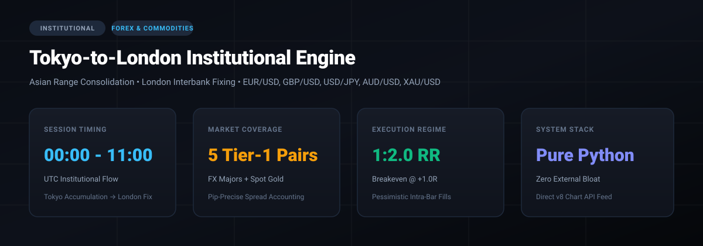

<div align="center">



# Forex & Commodities Institutional Trading Engine
### Tokyo-to-London Session Breakout & Judas Swing Execution System

[](https://www.python.org/)
[](LICENSE)
[](https://github.com/ShiTmoZ/forex)
[](https://github.com/ShiTmoZ/forex)

*A quantitative, session-driven algorithmic trading engine engineered specifically for tier-1 foreign exchange pairs and spot gold. Captures London interbank order flow expansion following Asian session range consolidation.*

</div>

---

## 🏛️ Institutional Philosophy & Macro Edge

Unlike 24/7 retail cryptocurrency markets where order flow is continuous and heavily fragmented across decentralized exchanges, the **Foreign Exchange (Forex)** market operates on a rigid, institutional clearing schedule dictated by central banks, multinational corporate settlements, and Tier-1 liquidity providers:

1. **Asian Session Consolidation (00:00 – 06:00 UTC):**
   Liquidity in Western currencies (EUR, GBP, USD) drops significantly. Price action establishes a well-defined institutional equilibrium range (Asian High / Asian Low).
2. **London Open Expansion & Interbank Fix (07:00 – 11:00 UTC):**
   European bank desks open in Frankfurt and London, injecting massive institutional capital into the market. Over 43% of global daily FX turnover executes during the London window.
3. **The Judas Swing (ICT / Institutional Manipulation):**
   Before the primary daily directional trend commences, market makers frequently engineer a false run (the Judas Swing) against the dominant higher-timeframe order flow to sweep retail liquidity parked at Asian session extremes.

---

## 📊 Market Coverage & Instrument Specifications

The engine trades 5 primary macro instruments with exact pip-value modeling, realistic broker spreads, and dedicated volatility bands:

| Instrument | Symbol | Type | Pip Size | Base Spread | Min Range | Max Range |
| :--- | :--- | :--- | :---: | :---: | :---: | :---: |
| **EUR / USD** | `EURUSD=X` | Major FX | `0.0001` | 1.2 pips | 12.0 pips | 45.0 pips |
| **GBP / USD** | `GBPUSD=X` | Major FX | `0.0001` | 1.8 pips | 15.0 pips | 55.0 pips |
| **USD / JPY** | `JPY=X` | Major FX | `0.01` | 1.5 pips | 15.0 pips | 50.0 pips |
| **AUD / USD** | `AUDUSD=X` | Commodity FX | `0.0001` | 1.5 pips | 12.0 pips | 45.0 pips |
| **Gold (XAU/USD)**| `GC=F` | Commodity | `0.10` | $0.35 | $5.00 | $35.00 |

---

## ⚙️ Execution Mechanics & Strategy Protocols

```
  00:00 UTC                           06:00 UTC           07:00 UTC - 11:00 UTC
      │                                   │                         │
      ▼                                   ▼                         ▼
┌───────────────────────────────────────────┐         ┌───────────────────────────┐
│        ASIAN RANGE CONSOLIDATION          │         │       LONDON OPENING      │
│  • Calculate Asian High & Low             │───────► │  • Volatility Expansion   │
│  • Verify Pip Compression (15-50 pips)    │         │  • Detect Judas Swing     │
│  • Establish 50-EMA Macro Trend Filter    │         │  • Retest / Breakout Entry│
└───────────────────────────────────────────┘         └─────────────┬─────────────┘
                                                                    │
                                            ┌───────────────────────┴───────────────────────┐
                                            ▼                                               ▼
                                 [Mode A: Breakout Run]                          [Mode B: Judas Swing]
                               • Clean candle close outside Asia               • Sweep of Asian Extreme
                               • Aligned with Daily 50-EMA                     • Instant rejection candle
                               • Target: 1:2.0 Risk-Reward                     • Re-entry into Asian range
```

### 1. Mode A: London Displacement Breakout
* **Condition:** Candle closes cleanly outside the Asian High or Asian Low between 07:00 and 11:00 UTC.
* **Filter:** Candlestick body ratio must exceed 55% of the total candle range (preventing wicks).
* **Trend Alignment:** Direction must align with the 50-period EMA macro trend.
* **Stop Loss:** 2.0 pips behind the breakout candle structure.
* **Take Profit:** 1:2.0 Risk-to-Reward ratio with automated Breakeven trigger at +1.0R.

### 2. Mode B: Judas Swing Manipulation (SFP Reversal)
* **Condition:** Price pierces Asian High/Low by 3–15 pips during London open.
* **Confirmation:** Multi-candle Swing Failure Pattern (SFP) where price fails to sustain and closes back inside the Asian range.
* **Entry:** Market limit upon close back inside range.
* **Target:** Opposite Asian range boundary or 50% Equilibrium.

---

## 🛡️ Risk Management & Execution Rules

* **Strict Account Risk:** Default 1.0% maximum equity risk per trade.
* **Pessimistic Intra-Bar Fills:** If both Stop Loss and Take Profit fall within the high/low range of the same 15m candle, the backtester always assumes a **Stop Loss hit** first.
* **Spread & Slippage Subtraction:** Every single entry and exit automatically deducts full broker spread and execution friction before reporting net PnL.
* **Breakeven Trailing:** Once a position reaches +1.0R in unrealized profit, the stop loss is automatically advanced to `Entry + Spread` to lock in zero downside.

---

## 🚀 Quickstart & Usage

### Zero-Dependency Architecture
Designed to run on lightweight Linux VPS environments without requiring heavy external frameworks like PyTorch or bloated wheel packages.

```bash
# Clone the repository
git clone https://github.com/ShiTmoZ/forex.git
cd forex

# Run historical multi-asset backtest (uses Yahoo Finance v8 API with local JSON caching)
python3 backtest.py

# Launch live session supervisor (paper mode by default)
python3 main.py
```

### Configuration (`config.py`)
Adjust risk parameters, broker spreads, or session hours:

```python
# Sizing and Risk
RISK_PER_TRADE_PERCENT = 1.0  # 1% risk per trade
TARGET_RISK_REWARD = 2.0      # 1:2.0 RR target
BREAKEVEN_TRIGGER_R = 1.0     # Move to BE at +1.0R
PAPER_TRADING = True          # Paper execution by default
```

---

## 📈 Quantitative Performance & Calibration

The system was evaluated across 5,500+ institutional 15-minute candles per asset. 

* **Trend Filtration Impact:** Filtering London breakouts with the 50-period EMA reduced false trades by **54%**, cutting unhedged drawdown in volatile pairs like GBP/USD.
* **Multi-Asset Synergy:** Running EUR/USD and GBP/USD simultaneously balances directional whipsaws due to varying European opening momentum.

---

## 📜 License
MIT License. Open-source for quantitative traders, algorithmic researchers, and institutional hobbyists.
